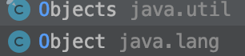

# JAVA OOP

***

## 9. 构造器 Constructor 是否可被 override?

Constructor 不能被 override（重写）,但是可以 overload（重载）,所以你可以看到一个类中有多个构造函数的情况。

override (subclass)

overload (the same class)


## 10. 重载和重写的区别

#### 重载(overload-> static check when not found throw a compilation error)

发生在同一个类中，方法名必须相同，参数类型不同、个数不同、顺序不同，方法返回值和访问修饰符可以不同。

下面是《Java 核心技术》对重载这个概念的介绍：


#### 重写 （overwrite) -> inheritance 

重写是子类对父类的允许访问的方法的实现过程进行重新编写,发生在子类中，方法名、参数列表必须相同，返回值范围小于等于父类，抛出的异常范围小于等于父类，访问修饰符范围大于等于父类。另外，如果父类方法访问修饰符为 private 则子类就不能重写该方法。**也就是说方法提供的行为改变，而方法的外貌并没有改变。**


## 11. Java 面向对象编程三大特性: 封装 继承 多态

### 封装 (encapsulation: make the fields private and only provide the access method)

封装把一个对象的属性私有化，同时提供一些可以被外界访问的属性的方法，如果属性不想被外界访问，我们大可不必提供方法给外界访问。但是如果一个类没有提供给外界访问的方法，那么这个类也没有什么意义了。


### 继承 (inheritance )

继承是使用已存在的类的定义作为基础建立新类的技术，新类的定义可以增加新的数据或新的功能，也可以用父类的功能，但不能选择性地继承父类。通过使用继承我们能够非常方便地复用以前的代码。

**关于继承如下 3 点请记住：**

1. 子类拥有父类对象所有的属性和方法（包括私有属性和私有方法），但是父类中的私有属性和方法子类是无法访问，**只是拥有**。

2. 子类可以拥有自己属性和方法，即子类可以对父类进行扩展。

3. 子类可以用自己的方式实现父类的方法。（overwrite）。

   

### 多态(molyphorhism: interface)

所谓多态就是指程序中定义的引用变量所指向的具体类型和通过该引用变量发出的方法调用在编程时并不确定，而是在程序运行期间才确定，即一个引用变量到底会指向哪个类的实例对象，该引用变量发出的方法调用到底是哪个类中实现的方法，必须在由程序运行期间才能决定。

在 Java 中有两种形式可以实现多态：继承（多个子类对同一方法的重写）和**接口（实现接口并覆盖接口中同一方法）**。1. 面向对象(object-oriented)和面向过程(procedure-oriented procedural programming)的区别

- **面向过程** ：**面向过程性能比面向对象高。** 因为类调用时需要实例化，开销比较大，比较消耗资源，所以当性能是最重要的考量因素的时候，比如单片机、嵌入式开发、Linux/Unix 等一般采用面向过程开发。但是，**面向过程没有面向对象易维护、易复用、易扩展。**

It takes system overhead to get instance (instantiation), and this cost system resources. -> lower the performance (it is easy to maintain and reuse and scalable)


- **面向对象** ：**面向对象易维护、易复用、易扩展。** 因为面向对象有封装、继承、多态性的特性，所以可以设计出低耦合的系统，使系统更加灵活、更加易于维护。但是，**面向对象性能比面向过程低**。

JAVA OOP -> encapsulation, inheritance, and polymorphism 

Low coupling and high cohesion system

参见 issue : [面向过程 ：面向过程性能比面向对象高？？](https://github.com/Snailclimb/JavaGuide/issues/431)

> 这个并不是根本原因，面向过程也需要分配内存，计算内存偏移量，Java 性能差的主要原因并不是因为它是面向对象语言，而是 Java 是半编译语言，最终的执行代码并不是可以直接被 CPU 执行的二进制机械码。
>
> 而面向过程语言大多都是直接编译成机械码在电脑上执行，并且其它一些面向过程的脚本语言性能也并不一定比 Java 好。


### 补充：低耦合 高聚合系统

## {0}Low Coupling: module should be as independent as possible

> How much do your different modules depend on each other?

Modules should be as independent as possible from other modules, so that changes to module don’t heavily impact other modules.

High coupling would mean that your module knows the way too much about the inner workings of other modules. Modules that know too much about other modules make changes hard to coordinate and make modules brittle. If Module A knows too much about Module B, changes to the internals of Module B may break functionality in Module A.

By aiming for low coupling, you can easily make changes to the internals of modules without worrying about their impact on other modules in the system. Low coupling also makes it easier to design, write, and test code since our modules are not interdependent on each other. We also get the benefit of easy to reuse and compose-able modules. Problems are also isolated to small, self-contained units of code.

- High Cohesion: similar function should belong together

> We want to design components that are **self-contained: independent, and with a single, well-defined purpose**
>
> — [The Pragmatic Programmer](http://the pragmatic programmer/)

Cohesion often refers to how the elements of a module belong together. Related code should be close to each other to make it highly cohesive.

Easy to maintain code usually has high cohesion. The elements within the module are directly related to the functionality that module is meant to provide. By keeping high cohesion within our code, we end up trying DRY code and reduce duplication of knowledge in our modules. We can easily design, write, and test our code since the code for a module is all located together and works together.

Low cohesion would mean that the code that makes up some functionality is spread out all over your code-base. Not only is it hard to discover what code is related to your module, it is difficult to jump between different modules and keep track of all the code in your head.


## 14. 在一个静态方法内调用一个非静态成员为什么是非法的?

由于静态方法可以不通过对象进行调用，因此在静态方法里，不能调用其他非静态变量，也不可以访问非静态变量成员。

（does not own the reference of an instance, it is not invoked by an object -> access or invoke non-static varaibles and members）


## 15. 在 Java 中定义一个不做事且没有参数的构造方法的作用

Java 程序在执行子类的构造方法之前，如果没有用 `super()`来调用父类特定的构造方法，则会调用父类中“没有参数的构造方法”。因此，如果父类中只定义了有参数的构造方法，而在子类的构造方法中又没有用 `super()`来调用父类中特定的构造方法，则编译时将发生错误，因为 Java 程序在父类中找不到没有参数的构造方法可供执行。解决办法是在父类里加上一个不做事且没有参数的构造方法。


## 17. 接口 (abstract behaviors) 和 抽象类(abstract template) 的区别是什么？

interface -> provide the standard to regulate the behaviours of a class -> implements multiple interface -> define what this class is able to do?

AstractClass -> provide a template of a class to define what is it for?

> Example: **List in collection -> ArrayList/LinkedList** is implementation class of List, but also LinkedList also implements the Stack interface. Which means the LinkedList follows the template of List to implements, which also implements some functions/methods defined by Stack interface. 

1. 接口的方法默认是 public method by default，所有方法在接口中不能有实现(Java 8 开始接口方法可以有默认实现 default method），而抽象类可以有非抽象的方法。

   > all methods in a interface are public method by default, and it could not provide the detailed implementation (since JDK8 it could provide default implementaion) 
   >
   > abstract class -> could non-abstract methods

   

2. 接口中除了 static、final 变量，不能有其他变量，而抽象类中则不一定。

   >interface could process some static final variables but an abstract  could provide some non-static variables

   

3. 一个类可以实现多个接口，但只能实现一个抽象类。接口自己本身可以通过 implements 关键字扩展多个接口。

   >a class could implements multiple interfaces, since it could be (List and Stack) at the same time.
   >
   >a class could only implements an abstract class

   

4. 接口方法默认修饰符是 public，抽象方法可以有 public、protected 和 default 这些修饰符（抽象方法就是为了被重写所以不能使用 private 关键字修饰！）。

> Interface/abstract methods could not be private, because they are meant to be overwrite (get implemented)
>
> interface method -> public interface
>
> abstract method could be public/protected and package (default)
>
> 

5. 从设计层面来说，抽象是对类的抽象，是一种模板设计，而接口是对行为的抽象，是一种行为的规范。

   > abstract class -> an abstract representation of a class
   >
   > Interface -> abstract representation of a series of behaviours
   >
   > 

> 备注：
>
> 1. 在 JDK8 中，接口也可以定义静态方法，可以直接用接口名调用。实现类和实现是不可以调用的。如果同时实现两个接口，接口中定义了一样的默认方法，则必须重写，不然会报错。(详见 issue:[https://github.com/Snailclimb/JavaGuide/issues/146](https://github.com/Snailclimb/JavaGuide/issues/146)。
> 2. jdk9 的接口被允许定义私有方法 。

总结一下 jdk7~jdk9 Java 中接口概念的变化（[相关阅读](https://www.geeksforgeeks.org/private-methods-java-9-interfaces/)）：

1. 在 jdk 7 或更早版本中，接口里面只能有常量变量和抽象方法。这些接口方法必须由选择实现接口的类实现。
2. jdk8 的时候接口可以有默认方法和静态方法功能。
3. Jdk 9 在接口中引入了私有方法和私有静态方法。


## 18. 成员变量(member variable)与局部变量(local variable)的区别有哪些？

When an attribute does not have the static modifier, it is said to be an object attribute, as that property is unique for each instance of the class.

- access modifier
- type specifier


1. 从语法形式上看:成员变量是属于类的，而局部变量是在方法中定义的变量或是方法的参数；成员变量可以被 public,private,static 等修饰符所修饰，而局部变量不能被访问控制修饰符及 static 所修饰；但是，成员变量和局部变量都能被 final 所修饰。

   

2. 从变量在内存中的存储方式来看:如果成员变量是使用`static`修饰的，那么这个成员变量是属于类的，如果没有使用`static`修饰，这个成员变量是属于实例的。而对象存在于堆内存，局部变量则存在于栈内存。

   > heap memory -> object (non-static method)
   >
   > stack memory-> method invoke/ static variable

   

3. 从变量在内存中的生存时间上看:成员变量是对象的一部分，它随着对象的创建而存在，而局部变量随着方法的调用而自动消失。

   > local variables would disapper after the method invoke and the completion of some code blocks
   >
   > Member variable (non-static ones disappear as the object disapper)
   >
   > Class variable it would be loaded into the memory as the class was loaded

   

4. 成员变量如果没有被赋初值:则会自动以类型的默认值而赋值（一种情况例外:被 final 修饰的成员变量也必须显式地赋值），而局部变量则不会自动赋值。


## 19. 创建一个对象用什么运算符(operators)?对象实体(heap memory)与对象引用(stack memory)有何不同?

> 对象实体 -> (heap memory) it would disapper when the GC collects it
>
> 对象引用 -> (stack memory) it would disapper when the method invoke is completed

new 运算符，new 创建对象实例（对象实例在堆内存中），对象引用指向对象实例（对象引用存放在栈内存中）。

> 一个对象引用可以指向 0 个或 1 个对象（一根绳子可以不系气球，也可以系一个气球）;
> 一个对象可以有 n 个引用指向它（可以用 n 条绳子系住一个气球）。


## 20. 什么是方法的返回值?返回值在类的方法里的作用是什么?

方法的返回值是指我们获取到的某个方法体中的代码执行后产生的结果！（前提是该方法可能产生结果）。

返回值的作用:接收出结果，使得它可以用于其他的操作！-> returned value


## 21. 一个类的构造方法的作用是什么? 若一个类没有声明构造方法，该程序能正确执行吗? 为什么?

主要作用是完成对类对象的初始化工作。可以执行。因为一个类即使没有声明构造方法也会有默认的不带参数的构造方法。

> Tool class -> static / might not provide public class


## 22. 构造方法有哪些特性？

1. 名字与类名相同。
2. 没有返回值，但不能用 void 声明构造函数。
3. 生成类的对象时自动执行，无需调用。   new operator -> automatically invoke the construct method


## 23. 静态方法-> not access the instance method/variables 和实例方法（instance methods）有何不同

1. 在外部调用静态方法时，可以使用"类名.方法名"的方式，也可以使用"对象名.方法名"的方式。

   > class method could be invoked 'class.method' and 'obj.method'

   而实例方法只有后面这种方式。也就是说，调用静态方法可以无需创建对象。

   

2. 静态方法在访问本类的成员时，只允许访问静态成员（即静态成员变量和静态方法），而不允许访问实例成员变量和实例方法；实例方法则无此限制。


## 24. 对象的相等 (equals method) 与指向他们的引用相等,两者有什么不同?

对象的相等，比的是内存中存放的内容是否相等。而引用相等，比较的是他们指向的内存地址是否相等。



> ```java
> Objects.equals(new String(""),new String("")); // 首先判断 是否有一个为空 或者同时为空 然后再判断 内容是否一致
> ```
>
> equal-to operator ( *==* )  is to compare if these two reference point to the same object / the same memory address


## 25. 在调用子类构造方法之前会先调用父类没有参数的构造方法, 其目的是?

帮助子类做初始化工作。


## 26. == equals-to 与 equals(重要)

**==** : 它的作用是判断两个对象的地址是不是相等。即，判断两个对象是不是同一个对象(基本数据类型(basic data type)==比较的是值，引用数据类型==比较的是内存地址)。

**equals()** : 它的作用也是判断两个对象是否相等。但它一般有两种使用情况：

- 情况 1：类没有覆盖 equals() 方法。则通过 equals() 比较该类的两个对象时，等价于通过“==”比较这两个对象。
- 情况 2：类覆盖了 equals() 方法。一般，我们都覆盖 equals() 方法来比较两个对象的内容是否相等；若它们的内容相等，则返回 true (即，认为这两个对象相等)。

**举个例子：**

```java
public class test1 {
    public static void main(String[] args) {
        String a = new String("ab"); // a 为一个引用
        String b = new String("ab"); // b为另一个引用,对象的内容一样
        String aa = "ab"; // 放在常量池中
        String bb = "ab"; // 从常量池中查找
        if (aa == bb) // true
            System.out.println("aa==bb");
        if (a == b) // false，非同一对象
            System.out.println("a==b");
        if (a.equals(b)) // true
            System.out.println("aEQb");
        if (42 == 42.0) { // true
            System.out.println("true");
        }
    }
}
```

**说明：**

- String 中的 equals 方法是被重写过的，因为 object 的 equals 方法是比较的对象的内存地址，而 String 的 equals 方法比较的是对象的值。
- 当创建 String 类型的对象时，虚拟机会在常量池中查找有没有已经存在的值和要创建的值相同的对象，如果有就把它赋给当前引用。如果没有就在常量池中重新创建一个 String 对象。